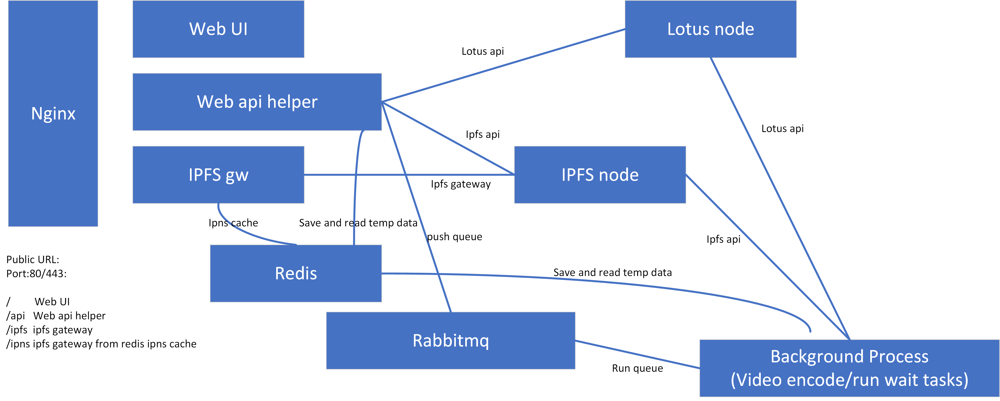

# 首个基于FileCash储存的视频演示
此项目将用于演示IPFS技术结合视频处理软件在FileCash网络上的应用演示。
## 1.架构图

## 2.技术指标定义以及语言选型、框架选型

nginx: openresty  
webui: nodejs vue bootstrap  
ipfs gateway publish: lua  
web api helper: python3 fastapi  
background process: python3 ffmpeg  

## 3.项目进度及未完成的项目

1. 基础服务配置搭建
    * □ redis 安装
    * □ rabbitmq 安装
    * □ ipfs node 搭建
    * □ ipfs public gateway 搭建
    * □ lotus filecash full node 搭建

## 4.部署方式

系统需求: Ubuntu20  
性能需求: 4 CPUs  
内存需求: 16G或更大  
磁盘需求: 100G用于存取缓存  
网络需求: 连接internet用于部署时下载依赖

